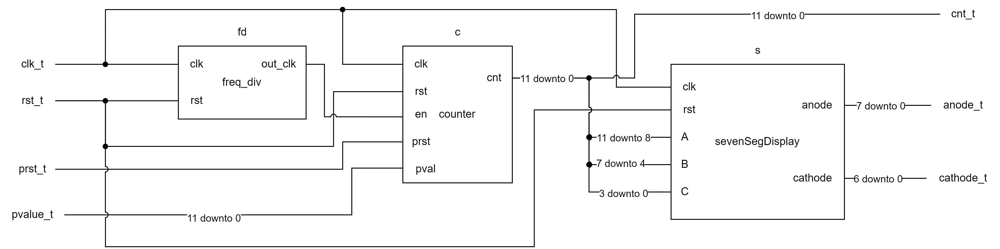
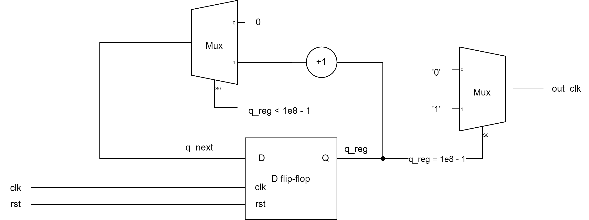
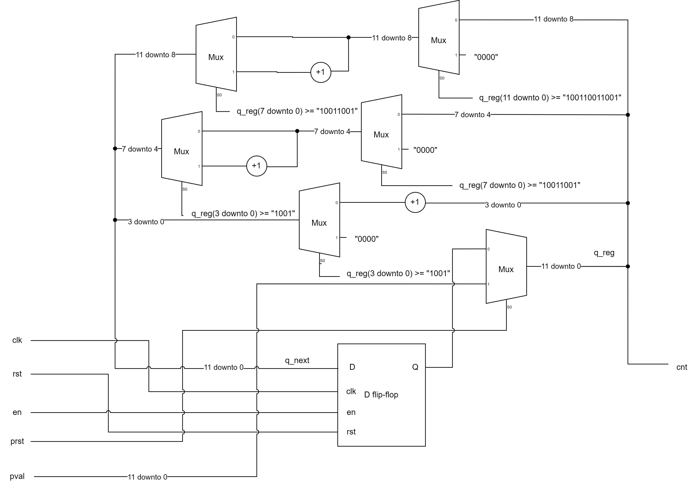
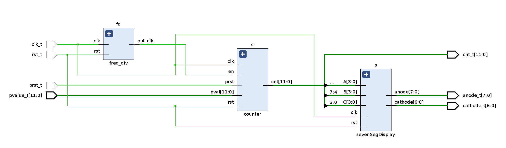
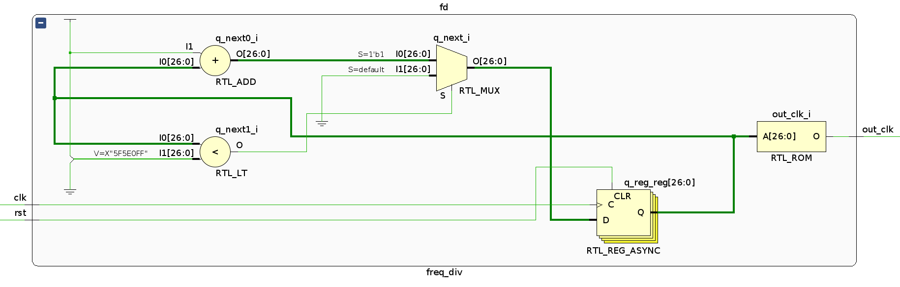
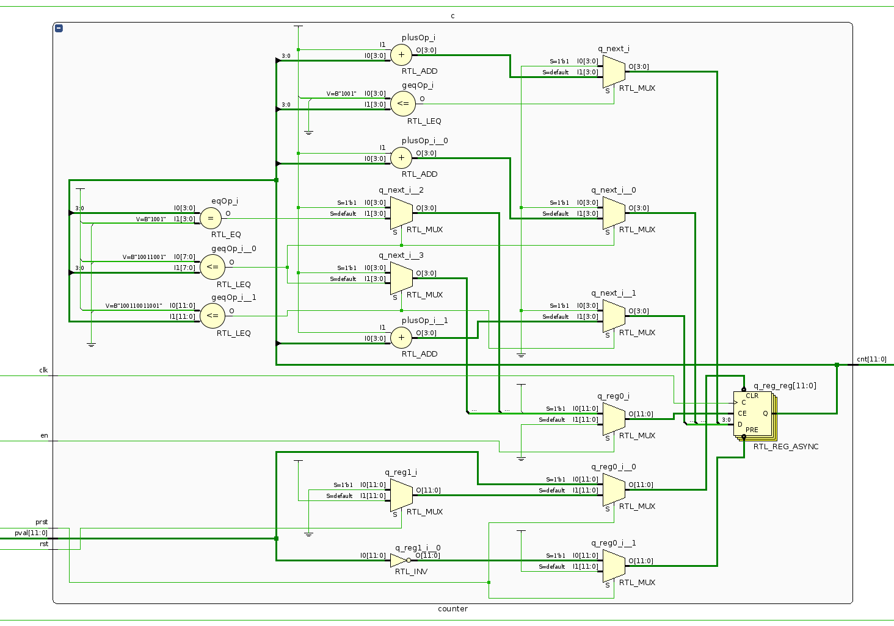
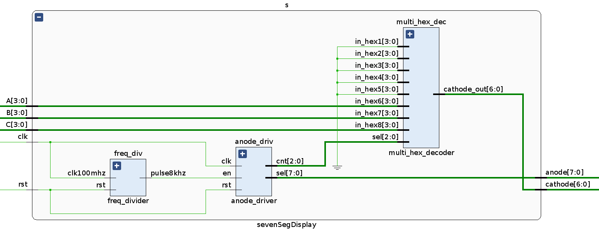
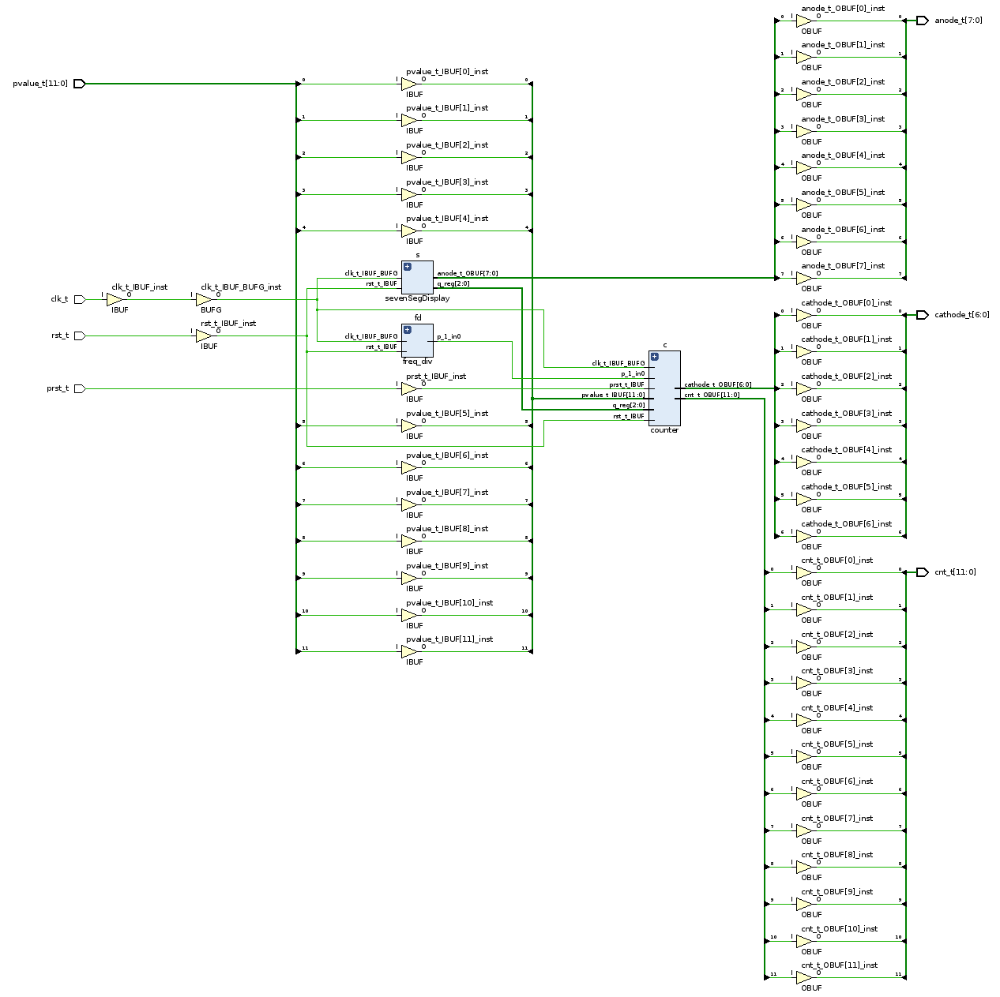
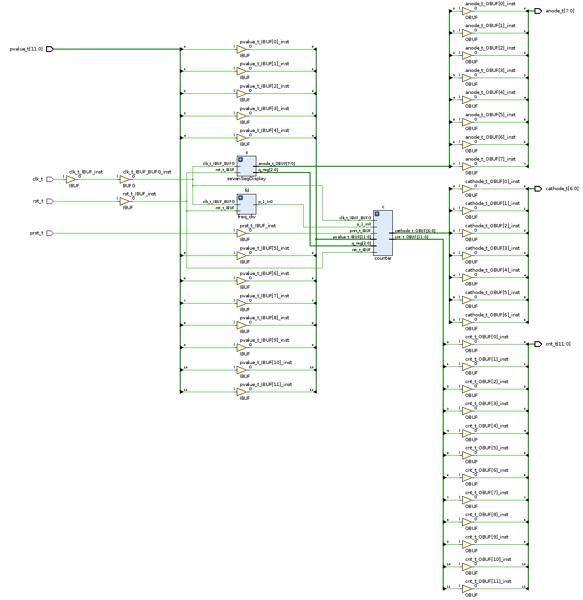

# 3-Digit Decimal Counter Design

# Conceptual Design

## Top Module Design

In this part, the conceptual diagram of the top module is shown in the following figure. To make the digital display more intuitive, I added an 8-digit seven-segment display **as an extension**, but the inside structure is investigated in lab 3, which is out of the scope of this report.

The symbols that appeared in the diagram are:

- `clk_t`: 100MHz internal clock input to the top module
- `rst_t`: reset signal from board input to the top module
- `prst_t`: preset signal from board input to the top module
- `pvalue_t`: preset value from 12 switches on board input to the top module

The corresponding `vhdl` code is shown below:

```vhdl
library ieee;
use ieee.std_logic_1164.all;
use ieee.numeric_std.all;

entity top_module is
    port (
        clk_t : in std_logic;
        rst_t : in std_logic;
        prst_t : in std_logic;
        pvalue_t : in std_logic_vector(11 downto 0);
        cnt_t : out std_logic_vector(11 downto 0);
        anode_t : out std_logic_vector(7 downto 0);
        cathode_t : out std_logic_vector(6 downto 0)
    );
end top_module;

architecture behavioral of top_module is
    component sevenSegDisplay is
        port (
            clk : in std_logic;
            rst : in std_logic;
            A : in std_logic_vector(3 downto 0);
            B : in std_logic_vector(3 downto 0);
            C : in std_logic_vector(3 downto 0);
            anode : out std_logic_vector(7 downto 0);
            cathode : out std_logic_vector(6 downto 0)
        );
    end component;
    component freq_div is
        port (
            clk : in std_logic;
            rst : in std_logic;
            out_clk : out std_logic
        );
    end component;

    component counter is
        port (
            clk : in std_logic;
            rst : in std_logic;
            en : in std_logic;
            prst : in std_logic;
            pval : in std_logic_vector(11 downto 0);
            cnt : out std_logic_vector(11 downto 0)       
        );
    end component;
    signal clk_div : std_logic;
    signal cnt : std_logic_vector(11 downto 0);
begin
    fd: freq_div port map(clk => clk_t, rst => rst_t, out_clk => clk_div);
    c: counter port map(clk => clk_t, rst => rst_t, en => clk_div, prst => prst_t, pval => pvalue_t, cnt => cnt);
    s: sevenSegDisplay port map(clk => clk_t, rst => rst_t, A => cnt(11 downto 8), B => cnt(7 downto 4), C => cnt(3 downto 0), anode => anode_t, cathode => cathode_t);
    cnt_t <= cnt;
end architecture;
```

## Frequency Divider Design



The symbols that appeared in the above figure are:

- `clk`: connected to the 100MHz internal clock
- `rst`: reset signal from the board
- `out_clk`: 1Hz pulse

The corresponding `vhdl` code is:

```vhdl
library ieee;
use ieee.std_logic_1164.all;
use ieee.numeric_std.all;

entity freq_div is
    port (
        clk : in std_logic;
        rst : in std_logic;
        out_clk : out std_logic
    );
end freq_div;

architecture behavioral of freq_div is
    constant N : integer := 1e8;
    signal q_reg, q_next : integer range 0 to N-1 := 0;
begin
    count_PROC : process(clk, rst) is
        begin
            if rst = '1' then
                q_reg <= 0;
            elsif (clk'event and clk = '1') then
                q_reg <= q_next;
            end if;
    end process;

    q_next <= (q_reg + 1) when q_reg < N-1 else 0;
    -- out_tmp <= (not out_tmp) when q_reg ;    !!don't use signal flipping in a singal concurrent statement or the output will be flipping all the time
    out_clk <= '1' when q_reg = N-1 else '0';
end architecture;
```

## Counter Design



The symbols that appear in the above figure are:

- `clk`: 100MHz clock signal from the board
- `rst`: reset signal from the board
- `en`: enable pulse from the frequency divider
- `prst`: preset signal from the board
- `pval`: preset value from the board

The corresponding `vhdl` code is:
```vhdl
library ieee;
use ieee.std_logic_1164.all;
use ieee.numeric_std.all;
use ieee.std_logic_unsigned.all;    -- for the "+" operator in std_logic_vector

entity counter is
    port (
        clk : in std_logic;
        rst : in std_logic;
        en : in std_logic;
        prst : in std_logic;
        pval : in std_logic_vector(11 downto 0);
        cnt : out std_logic_vector(11 downto 0)       
    );
end counter;

architecture behavioral of counter is
    signal q_reg, q_next : std_logic_vector(11 downto 0):= (others => '0');
begin
    process(clk, rst, prst) is
    begin
        if prst = '1' then
            q_reg <= pval;
        elsif rst = '1' then
            q_reg <= (others => '0');
        elsif (clk'event and clk = '1' and en = '1') then
            q_reg <= q_next;
        end if;
    end process;

    q_next(3 downto 0) <= "0000" when q_reg(3 downto 0) >= "1001" else q_reg(3 downto 0) + 1;
    q_next(7 downto 4) <= "0000" when q_reg(7 downto 0) >= "10011001" else q_reg(7 downto 4) + 1 when q_reg(3 downto 0) >= "1001" else q_reg(7 downto 4);
    q_next(11 downto 8) <= "0000" when q_reg(11 downto 0) >= "100110011001" else q_reg(11 downto 8) + 1 when q_reg(7 downto 0) >= "10011001" else q_reg(11 downto 8);
    cnt <= q_reg;
end architecture;
```

# RTL Schematics

We can validate whether the code describes the exact design we expected using the RTL schematics function in Vivado. This section shows all the RTL schematics of the above designs.

## Top Module



## Frequency Divider



## Counter



## Seven Segment Display

Since this module is directly modified from lab 3, it contains a redundant design to support an eight-digit display, but we only require 3 digits to display 0-999. Thus, some of the ports are directly pulled down to GND.



# Post-Synthesis Schematic



# Post-Implementation Schematic



