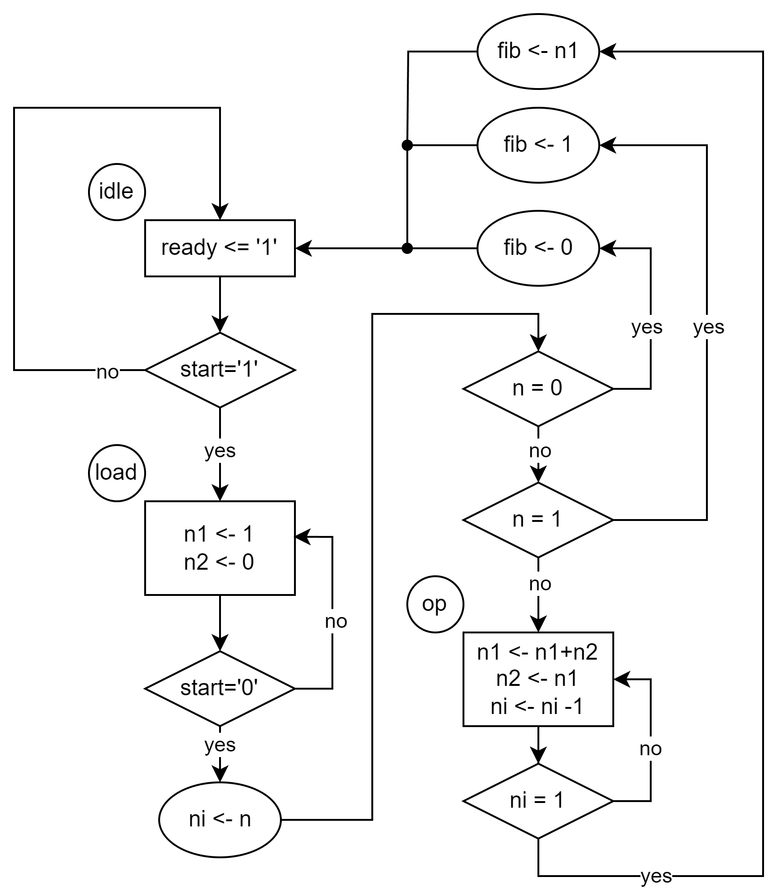
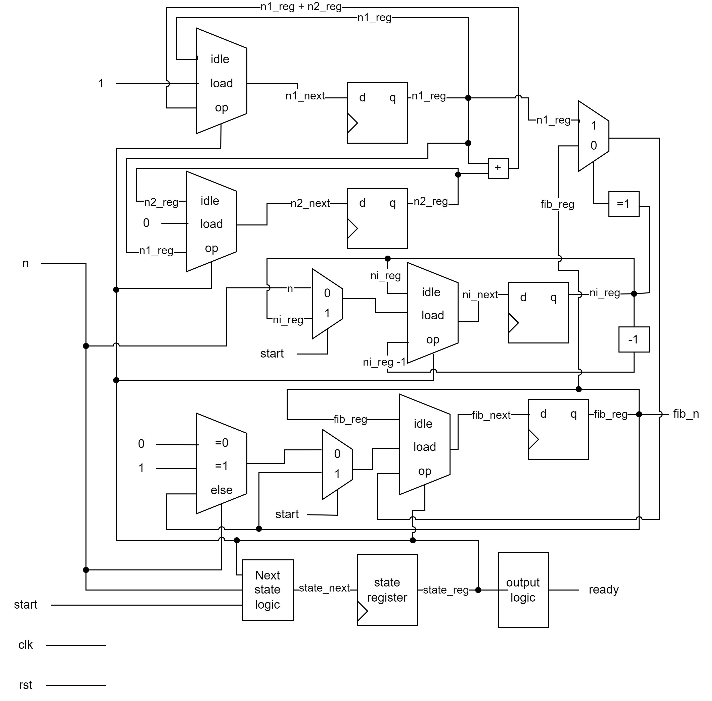
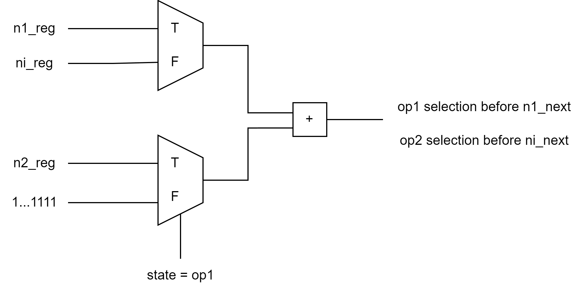

# Fibonacci Function Implementation with FSMD

# Introduction

In this lab, I implement a Fibonacci function on an FPGA board using **F**inite **S**tate **M**achine with **D**atapath (FSMD). It can receive 6-bit input using the switches on board and calculate its Fibonacci value. The calculated value (in hexadecimal) is displayed by seven-segment LED digital tubes.

Keywords: Fibonacci, FSMD, seven-segment display

# I/O Interface


As shown in Figure todo, the elements are:

- `6-bit input`: the desired `n` to calculate the Fibonacci sequence, i.e., fib(n).
- `ready`: when this LED is lit, it means the system is in the `idle` state and it is ready to receive the user’s input.
- `Fibonacci result`: the fib(n) result is displayed in hexadecimal.
- `reset`: reset the system.

- `start/load`: this signal is represented only by the symbol `start` in the program and the ASM chart. When `start=1`, the system will clear the previous result and enter the `load` state. At this time, the user is supposed to enter the `6-bit input`. Then, set start=0, and the system will start operating to calculate the Fibonacci value.

# Design Procedure

## Step 1: Defining the input and output signals

According to the I/O interface defined above, the input and output signals required are:

- Input signals:
  - `clk`: system clock.
  - `rst`: reset signal.
  - `n`: 6-bit input signal to calculate the $n^{th}$ term of the Fibonacci sequence.
  - `start`: command. The system enters the `load` state when `start=1` and starts operating after the `start` switch from 1 to 0.

- Output signals:
  - `fib_n`: calculation results of $fib(n)$.
  - `ready`: indicate the system is idle.

## Step 2: Converting the algorithm to an ASM chart

According to the functionality discussed in I/O interfaces section, the ASM chart can be constructed as in Figure todo, where `n` is the 6-bit input:


## Step 3: Constructing the FSMD

1. The circuit requires 4 registers to store signals `n1`, `n2`, `fib`, and `ni`.

2. The RT operations:

   - RT operation with the `n1` register

     - n1 <- 1 (in the `load` state)
     - n1 <- n1 + n2 (in the `op` state)

     - RT operation with the `n2` register
       - n2 <- 0  (in the `load` state)
       - n2 <- n1 (in the `op` state)

     - RT operation with the `fib` register
       - fib <- 0 (in the `load` state and  n = 0 and start = 0)
       - fib <- 1 (in the `load` state and n = 1 and start = 0)
       - fib <- n1 (in the `op` state and ni =1)

   - RT operation with the `ni` register
     - ni <- n (in the `load` state and start = ‘0’)
     - ni <- ni -1 (in the `op` state)

3. Conceptual diagram is shown in Figure todo.

​	

## Step 4: VHDL description of FSMD

```vhdl
library ieee;
use ieee.std_logic_1164.all;
use ieee.numeric_std.all;
use ieee.std_logic_arith.all;
use ieee.std_logic_unsigned.all;

entity fib is
    port (
        clk : in std_logic;
        rst : in std_logic;
        n : in std_logic_vector(5 downto 0);
        start : in std_logic;
        fib_n : out std_logic_vector(31 downto 0);
        ready : out std_logic
    );
end fib;

architecture rtl of fib is
    type state_type is (idle, load, op);
    signal state_reg, state_next : state_type;
    signal n1_reg, n1_next, n2_reg, n2_next : std_logic_vector(31 downto 0);
    signal ni_reg, ni_next : std_logic_vector(5 downto 0);
    signal fib_reg, fib_next : std_logic_vector(31 downto 0);
begin
    --- state and data registers
    process(clk, rst) is
    begin
        if rst = '1' then
            state_reg <= idle;
            n1_reg <= std_logic_vector(to_unsigned(1,32));
            n2_reg <= ((others => '0'));
            ni_reg <= (others => '0');
            fib_reg <= (others => '0');
        elsif rising_edge(clk) then
            state_reg <= state_next;
            n1_reg <= n1_next;
            n2_reg <= n2_next;
            ni_reg <= ni_next;
            fib_reg <= fib_next;
        end if;
    end process;

    --- combinational circuit
    --- only use the input value and register value in "if" statement
    --- only assign value to next_value in this process
    --- output signal needs to be taken from a register value
    process (start, state_reg, n1_reg, n2_reg, ni_reg, fib_reg, n) is
    begin
        --- default values
        ready <= '0';
        fib_next <= fib_reg;
        state_next <= state_reg;
        n1_next <= n1_reg;
        n2_next <= n2_reg;
        ni_next <= ni_reg;

        case state_reg is
            when idle => 
                ready <= '1';
                if start = '1' then
                    state_next <=  load;
                end if;
            when load =>
                n1_next <= std_logic_vector(to_unsigned(1,32));
                n2_next <= (others => '0');
                if start ='0' then
                    ni_next <= n;   --- don't assign a signal and use it immediately in a process (delta delay)
                    if n = 0 then
                        fib_next <= (others => '0');
                        state_next <= idle;
                    elsif n = 1 then
                        fib_next <= std_logic_vector(to_unsigned(1,32));
                        state_next <= idle;
                    else
                        state_next <= op;
                    end if;
                end if;
            when op => 
                n1_next <= n1_reg + n2_reg;
                n2_next <= n1_reg;
                ni_next <= ni_reg - 1;
                if ni_reg = 1 then
                    fib_next <= n1_reg;
                    state_next <= idle;
                end if;
        end case;
    end process;
    fib_n <= fib_reg;
end architecture;
```

# Possible Improvement

There is an addition operation and a subtraction operation in the RT operations, which can share a single “plus” operator. These two operations are:

- n1 <- n1 + n2 (in the `op` state)

- ni <- ni -1 (in the `op` state)

However, since these two operations both take place in `op` state, we need to divide `op` state into two states to share the operator, for example:

- n1 <- n1 + n2 (in the `op1` state)

- ni <- ni -1 (in the `op2` state)
- n2 <- n1 (in the `op1` state)
- fib <- n1 (in the `op2` state and ni =1)

The main part of the operator sharing scheme is shown in Figure todo.



The main change of the VHDL code is shown below:

```vhdl
...
    when op1 => 
        n1_next <= n1_reg + n2_reg;
        n2_next <= n1_reg;
        state_next <= op2;
    when op2 => 
        ni_next <= ni_reg - 1;
        if ni_reg = 1 then
            fib_next <= n1_reg;
        	state_next <= idle;
        end if;
...
```

# Analysis and Comparison

While the sharing operator method can reduce the number of adders from 2 to 1, it lengthens the overall delay.

For the original version, the `op` state finishes after **n-1** clock cycles. 

However, suppose we add another state to make sure the operator sharing is feasible. In that case, we now need  **2\*(n-1)** clock cycles to finish the operation because the changing of state also needs an extra clock cycle.

# Conclusion

In this lab, we delved into the construction of FSMD. Specifically, we implemented a Fibonacci Function using the FSMD. We analyzed and built the FSMD step by step. We also explore a way to improve the code by using operator sharing. However, sharing operators can greatly increase the system delay, which is an important issue that needs to be considered when designing a system.