# Full Adder Simulations Report

# Introduction

In this lab, I built full adder simulations in `Vivado` software, involving behavioral simulation, post-synthesis functional simulation, post-synthesis timing simulation, post-implement functional simulation, and post-implement timing simulation. After these elaborate simulations, I had a better understanding of the basics of digital system design. In short, digital system design is quite different from developing software, which not only requires us to write feasible and logical code but also requires us to have physical hardware in mind. The most significant difference is that concurrent statements are the main components in a `VHDL` file, which means the statements do not execute line by line. Due to the physical constraints on board, I also understand that not all designs are synthesizable or implementable,  and even if one design is capable of being synthesized, it may appear different behaviors in different simulation stages.

# Prerequisite

This lab focuses on full adder, so let’s first analyze a full adder using Boolean algebra. 

Basically, a full adder can be described in the following Boolean expression:
$$
\begin{align*}
s1&=A\oplus B\\
s2&=Cin\times s1\\
s3&=A\times B\\
sum&=s1\oplus Cin\\
cout&=s2 + s3\\
\end{align*}
$$
This expression can be transferred to an equivalent logic diagram  (Figure TODO):
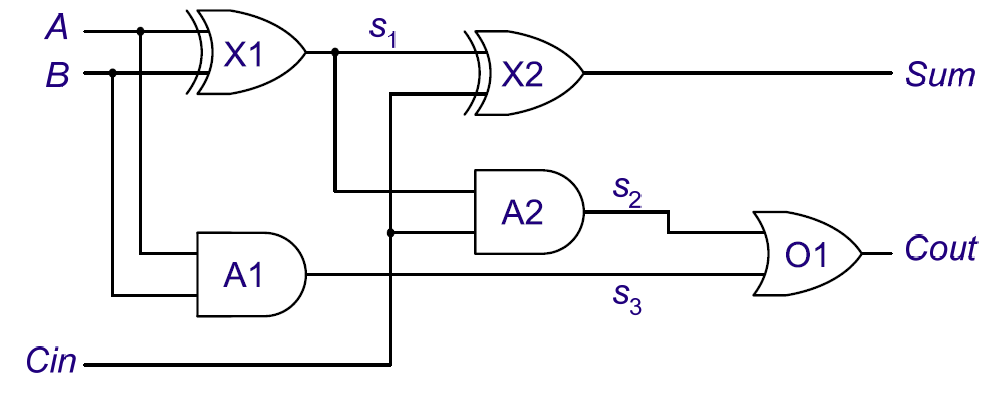

where $A$ and $B$ are two one-bit inputs,  $Cin$ is the carry bit of the previous bit full adder (i.e. $Cout$ of the previous full adder). $s1$, $s2$ and $s3$​​ are intermediate signals. 

When applying the stimulus signals like Figure TODO, using the Boolean algebra, we can then manually derive the timing diagram (Figure TODO) of the above logic diagram.

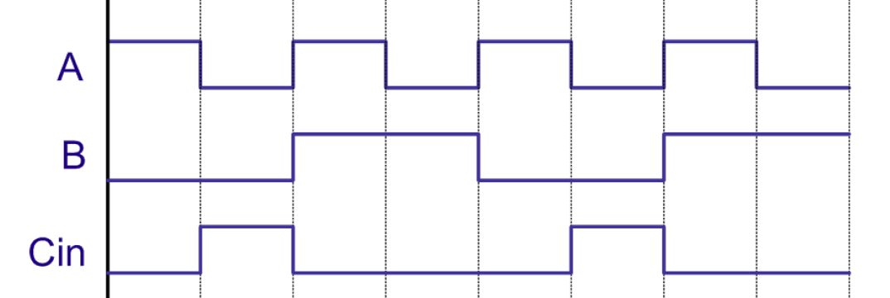

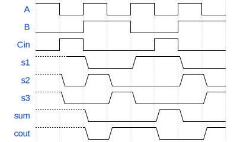

**Note that**, we added a 10ns of gate delay to all the gates above. Every grid represents 10ns. The dotted line in the signal means at this time, the signal is not yet initialized. In this timing diagram, the intermediate signals as well as the output signals are represented in a slow-variation fashion (i.e. there is a ramp when the signal jumps from 0 to 1 or vice versa).

# Source Code Analysis

## Design Source

Describing the logic diagram in `VHDL` language is easy, the core part of the full adder’s code is almost a direct translation of the Boolean expression.

```vhdl
architecture dataflow of full_addr is
    signal s1, s2, s3 : std_logic;
    constant gate_delay : time := 10 ns;
begin
    L1: s1 <= (A xor B) after gate_delay;
    L2: s2 <= (Cin and s1) after gate_delay;
    L3: s3 <= (A and B) after gate_delay;
    L4: sum <= (s1 xor Cin) after gate_delay;
    L5: cout <= (s2 or s3) after gate_delay;
end architecture dataflow;
```

We set the `gate_delay` explicitly here as 10ns.

## Testbench

Testbench is a kind of special `.vhd` file, which is used to verify the design source. Typically, a testbench doesn’t have any input/output port, and it treats the design source as a kind of *blackbox* component. It applies self-defined stimulus signals and measures the output of the *blackbox*. 

To treat the design source as a component, we need to first declare the input/output port of the full_adder like the code below:
```vhdl
    component full_addr is 
        port(A, B, Cin : in std_logic;
             Sum, Cout : out std_logic);
    end component full_addr;
```

Then in the body of the architecture, we instantiated the full adder component.

```vhdl
    UUT : full_addr port map (A=>A_tb, B=>B_tb, Cin=>Cin_tb, Sum=>Sum_tb, Cout=>Cout_tb);
```

After the *blackbox* is ready, we design the stimulus signals as Figure TODO, using a naive implementation shown in the below code:
```vhdl
    -- Define stimulus signal
    A_tb <= '1', '0' after 10ns, '1' after 20ns,'0' after 30ns, '1' after 40ns,'0' after 50ns, '1' after 60ns,'0' after 70ns;
    B_tb <= '0', '1' after 20ns, '0' after 40ns, '1' after 60ns;
    Cin_tb <= '0', '1' after 10ns, '0' after 20ns, '1' after 50ns, '0' after 60ns;
```

# Simulation Results

The simulated object in this part is the testbench code. During the different stage of the simulation (i.e behavioral, post-synthesis, post-implement simulations), the simulation results are different.

## Behavioral Simulation

Behavioral simulation is completely based on the source design code, which is really alike the process of compiling source code. All the gate delays are preserved in this stage of simulation. The result is as follows (Figure TODO):
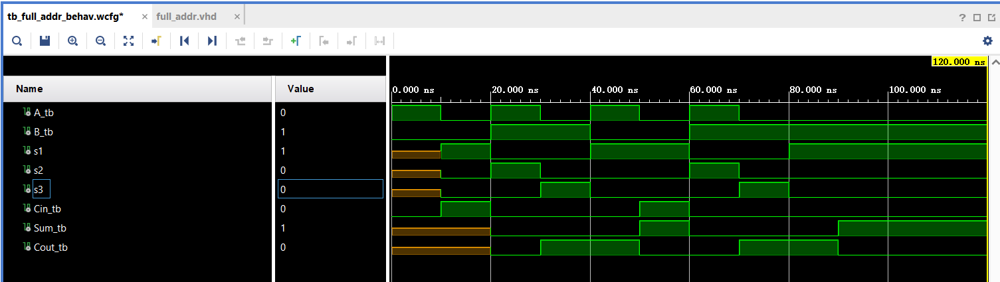

The behavioral simulation result is the same as the previous manually developed results (Figure TODO). If we look at the RTL schematic (Figure TODO), we notice that the logic diagram is totally the same as Figure TODO. 

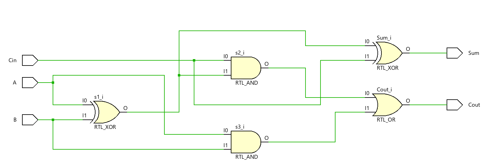

However, due to the huge gate delay we set for the behavioral simulation, the addition result is not consistent with our common sense, since the input signals vary as quickly as the gate delay.

**To make it closer to our common sense**, we can simply modify the gate delay to 0ns, and rerun the simulation. The result (Figure TODO) is more like an intuitive full adder now.

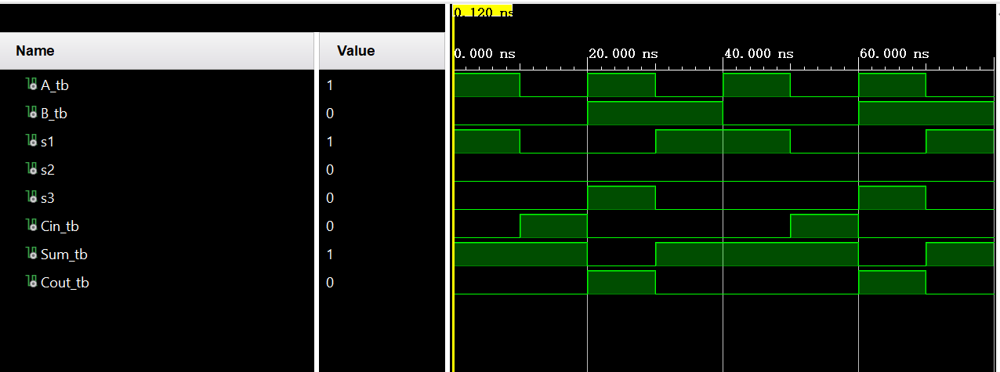

## Post-Synthesis Simulation

The synthesis process transfers the design source to a physically compatible design, regardless of the specific hardware board. Since onboard devices mainly involve Look-up tables (LUTS) and use them to fulfill combinational logic, it may have some performance differences with that design directly using logic gates to accomplish. Moreover, the synthesis process eliminates those unnecessary self-defined gate delays. The schematic of the synthesis result (Figure TODO) doesn’t resemble the one in the previous RTL schematic (Figure TODO), showing the root cause of the difference between the post-synthesis simulation and the behavioral simulation.

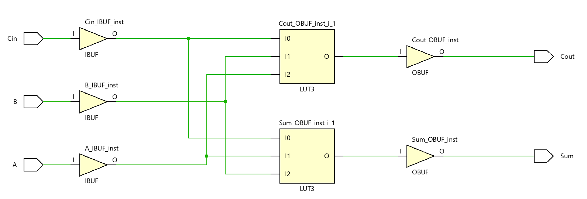

### Functional

Post-synthesis functional simulation eliminates all self-defined gate delays as well as the actual gate delays. The result is as Figure TODO, which is the same as the zero gate delay behavioral simulation, and it is consistent with our common sense of a full adder.

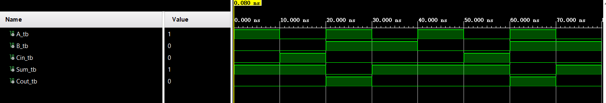

**Note:** Although the synthesis eliminates those self-defined gate delays in the source design file (i.e. statement like `after x ns`), the stimulus signals defined in the testbench preserved the timing characteristic.

### Timing

Post-synthesis timing simulation only differs from the functional simulation in that it involves generally estimated gate delays (i.e. gate delays in different devices are estimated the same). As shown in Figure TODO, the output signals `Sum_tb` and `Count_tb` are simply a constant time-delayed version of the functional simulation as shown in Figure TODO.

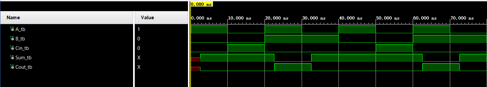

## Post-Implementation Simulation

Post-implementation is also regarded as post-place-and-route simulation. This type of simulation considered the actual hardware devices on board as well as the wiring. However, in this lab, post-implementation simulation is generally alike post-synthesis simulation. The schematic of the implementation result (Figure TODO) is the same as the synthesis result (Figure TODO).

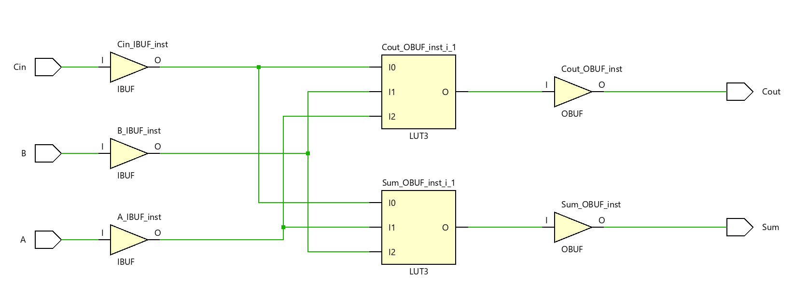

### Functional

The post-implementation functional simulation also ignores the self-defined gate delays in the source design while preserving the timing characteristic defined in the testbench. The simulation result (Figure TODO) is consistent with our common sense as well as the post-synthesis functional simulation.

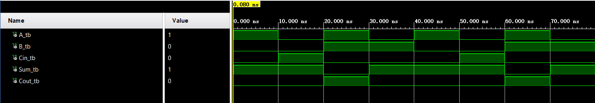

### Timing

The most important part of the post-implementation timing simulation is that it considers the actual gate delays of different devices and the transport delay (i.e. delay due to the signal propagation in wires ), so it can uncover some potential problems in our previous design. In this lab, post-implementation timing simulation does do this job. As shown in Figure TODO, there are a lot of spikes in the waveforms, which indicates that the design exhibits **race hazard**. Race hazard is usually due to the simultaneous variations of several input signals which can result in opposite output. 

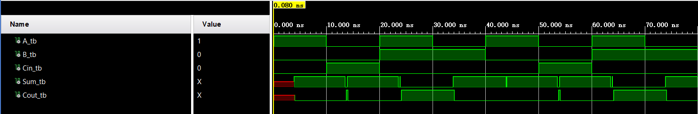

# Extension: Eliminating Spikes In Post-Implementation Simulation


# Conclusion

In this lab, we investigate the differences among the five types of simulations. These simulations stand for each stage we carry our design from a draft to a hardware-compatible one. As the simulation proceeds, we can discover if our design can be carried out on physical hardware. Post-synthesis simulation tells us how the logic gate will be replaced by stuff like LUTs on hardware, and whether this design is synthesizable. Then post-implementation simulation helps us uncover potential problems that will happen on hardware.


