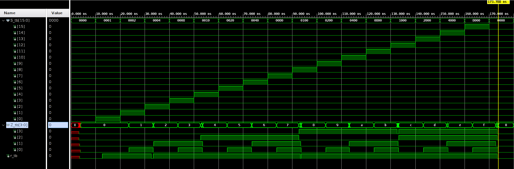
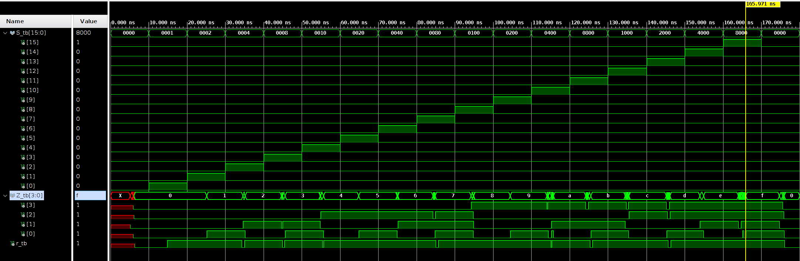
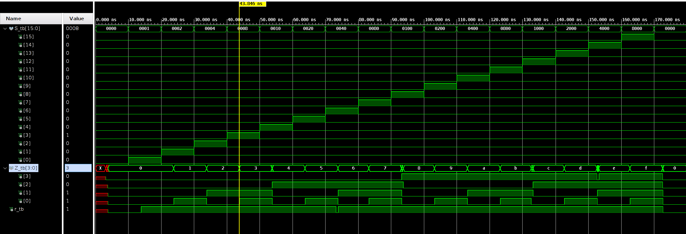

# Analysis of Two Types of 16-to-4 Priority Encoders

# Introduction

In this lab, we delve into the comparison of two types of 16-4 priority encoders, one of which is made up of cascaded multiplexers, and the other is primarily made up of several 4-2 encoders and a 4-1 multiplexer. We refer to the former as a chain-like structure and the latter as a tree-like structure because of their RTL schematic. Ideally, a chain-like structure exhibits a more significant overall delay due to a longer critical path, and a tree-like structure can eliminate this problem. However, several phenomena shown in the below report reveal that in most situations, it is not a good idea to develop a tree-like structure in the design source. Instead, we should design `vhdl` code in a relatively simple way.

Keywords: priority encoder; chain-like structure; tree-like structure; compiler optimization

# Block Diagrams

In this section, we derive two kinds of structures of 16-to-4 priority encoders in conceptual diagrams and analyze their critical paths and worst-case delays.

## Chain-Like Structure

Firstly, the basic element of a chain-like structure looks something like Figure TODO. In this graph, all the multiplexers are cascaded in this fashion.


And be aware that, it is essential to handle the bit width of the signals and the endpoint of this chain.

As shown in Figure TODO, for example, $S[1]$ is a one-bit signal, but before it is input to the mux, we should add zeros to ensure the two input signals to the mux are both 2-bit in length. This phenomenon also appears in the later graph, and the takeaway message is that we should ensure two inputs to the mux are of the same size. Another problem shown in Figure TODO is that $S[1]$ is not the selecting signal. Instead, it can be directly input to the first mux. $S[0]$ can be left open or used as one of the inputs to determine if the encoder has input signals.


Therefore, we need **14** muxes to build a chain-like structure of the 16-to-4 encoder. **The critical path traverses all 14 muxes**, which can lead to a significant delay of the device.

## Tree-like structure

The alternative to the chain-like structure is the tree-like structure, which means the muxes are not cascaded to minimize the overall delay.

To build a tree-like structure, we first need to build a basic element, a 4-to-2 priority encoder as shown in Figure TODO. In this figure, the number on the wire is the bit length of the signals. **Also note that every single 4-to-2 priority encoder consists of 2 muxes, and the path to output signal $r$ does not pass any of the muxes**.


After we have the basic element, we can build the entire tree-like structure (Figure TODO). The design is to observe the output of the four 4-to-2 encoders at the leftmost. We discover the fact that we can assign the higher 2 bits using $r$ signals from the leftmost encoders, then use $r$ as an address to select the lower 2 bits from the $Z$​ signals of the leftmost encoders.


Consider that a 4-to-1 multiplexer typically has the structure shown in Figure TODO, which indicates that all signals input to the 4-to-1 multiplexer have a critical path consisting of 2 mux(2-to-1). **Therefore, we can conclude that a tree-like structure has a critical path consisting of 4 mux (2 from the 4-to-2 encoder and 2 from the 4-to-1 mux).**


# Source Design

## Top module

The top module is used as a switcher. It switches between two structures by instantiating different entities. In Vivado, we need to set the top module as the top of the source file. **Note that only the entities instantiated in the top module will be synthesized and implemented.**

```vhdl
library ieee;
use ieee.std_logic_1164.all;
use ieee.numeric_std.all;

entity top_module is
    port (
        S: in std_logic_vector(15 downto 0);
        Z : out std_logic_vector (3 downto 0);
        r : out std_logic
    );
end top_module;

architecture behavioral of top_module is
    component prior_tree
        port (
            S: in std_logic_vector(15 downto 0);
            Z : out std_logic_vector (3 downto 0);
            r : out std_logic
        );
    end component;

    -- component prior_enc
    --     port (
    --         S: in std_logic_vector(15 downto 0);
    --         Z : out std_logic_vector (3 downto 0);
    --         r : out std_logic
    --     );
    -- end component;
begin
    prior_tree_t: prior_tree port map (S, Z, r);
    -- prior_enc_t: prior_enc port map (S, Z, r);
end architecture;
```


## Chain-Like Structure

The source code of a chain-like structure is relatively easy. It just lists out all the possible output based on the priorities.

```vhdl
library ieee ;
    use ieee.std_logic_1164.all ;

entity prior_enc is
  port (
    S : in std_logic_vector(15 downto 0) ;
    Z : out std_logic_vector(3 downto 0);
    r : out std_logic
  ) ;
end prior_enc ; 

architecture arch of prior_enc is
begin
    Z <= "1111" when S(15)='1' else
        "1110" when S(14)='1' else
        "1101" when S(13)='1' else
        "1100" when S(12)='1' else
        "1011" when S(11)='1' else
        "1010" when S(10)='1' else
        "1001" when S(9)='1' else
        "1000" when S(8)='1' else
        "0111" when S(7)='1' else
        "0110" when S(6)='1' else
        "0101" when S(5)='1' else
        "0100" when S(4)='1' else
        "0011" when S(3)='1' else
        "0010" when S(2)='1' else
        "0001" when S(1)='1' else
        "0000" when S(0)='1' else
        "0000" ;
    r <= (((S(15) or S(14)) or (S(13) or S(12))) or ((S(11) or S(10)) or (S(9) or S(8)))) or (((S(7) or S(6)) or (S(5) or S(4))) or ((S(3) or S(2)) or (S(1) or S(0)))) ;

  end architecture ; 
```

Note that in the expression for $r$, I use a lot of pairwise brackets to enclose the “or” expressions to minimize the critical path of signal $r$​.

The RTL schematic for this code is shown in Figure TODO.


## Tree-Like Structure

Based on the previously derived result, first, we need to build a 4-to-2 priority encoder, which is described by the below code:
```vhdl
library ieee;
use ieee.std_logic_1164.all;
use ieee.numeric_std.all;

entity prior_enc42 is
    port (
        S42: in std_logic_vector(3 downto 0);
        Z42 : out std_logic_vector (1 downto 0);
        r42 : out std_logic
    );
end prior_enc42;

architecture behavioral of prior_enc42 is
    begin
    Z42 <= "11" when S42(3) = '1' else
        "10" when S42(2) = '1' else
        "01" when S42(1) = '1' else
        "00" when S42(0) = '1' else
        "00";
        r42 <= (S42(3) or S42(2)) or (S42(1) or S42(0)); --indicating that there is a 1 in the input
    end architecture;
```

Then, using a 4-to-2 encoder as a component, we can build the entire tree-like structure.

```vhdl
library ieee;
use ieee.std_logic_1164.all;

entity prior_tree is
    port (
        S : in std_logic_vector(15 downto 0) ;
        Z : out std_logic_vector(3 downto 0);
        r : out std_logic
      ) ;
end prior_tree;

architecture structure of prior_tree is
component prior_enc42 is
    port (
        S42: in std_logic_vector(3 downto 0);
        Z42 : out std_logic_vector (1 downto 0);
        r42 : out std_logic
    );
end component;
signal h_enc_in : std_logic_vector(3 downto 0);
signal l_enc3_out, l_enc2_out, l_enc1_out, l_enc0_out, h_enc_out, l_enc_out: std_logic_vector(1 downto 0);
begin
    l_enc3: prior_enc42 port map (S42 => S(15 downto 12), Z42 => l_enc3_out, r42 => h_enc_in(3));
    l_enc2: prior_enc42 port map (S42 => S(11 downto 8), Z42 => l_enc2_out, r42 => h_enc_in(2));
    l_enc1: prior_enc42 port map (S42 => S(7 downto 4), Z42 => l_enc1_out, r42 => h_enc_in(1));
    l_enc0: prior_enc42 port map (S42 => S(3 downto 0), Z42 => l_enc0_out, r42 => h_enc_in(0));
    h_enc: prior_enc42 port map (S42 => h_enc_in, Z42 => h_enc_out, r42 => r);
    
    Z(3 downto 2) <= h_enc_out;
    with h_enc_out select
        l_enc_out <= l_enc3_out when "11",
                          l_enc2_out when "10",
                          l_enc1_out when "01",
                          l_enc0_out when "00",
                          "00" when others;
    Z(1 downto 0) <= l_enc_out; -- I tried not using l_enc_out and directly assigning Z(1 downto 0) in the 4-2multiplexer, but it introduces an additional register
end architecture;
```

The RTL schematic of the tree-like structure is shown in Figure TODO.


# Testbench Design

In the testbench code, I simulated the 16-bit input and encoded them.

```vhdl
library ieee ;
    use ieee.std_logic_1164.all ;
    use ieee.numeric_std.all ;

entity tb_prior_enc is

end tb_prior_enc ; 

architecture test of tb_prior_enc is
    component top_module is
        port (
            S: in std_logic_vector(15 downto 0);
            Z : out std_logic_vector (3 downto 0);
            r : out std_logic
        );
    end component ;


    signal S_tb : std_logic_vector(15 downto 0) ;
    signal Z_tb : std_logic_vector(3 downto 0) ;
    signal r_tb : std_logic ;
begin
    UUT: top_module port map(S => S_tb, Z => Z_tb, r => r_tb) ;
    
    seq: process
    begin
        S_tb <= "0000000000000000" ;
        wait for 10 ns ;
        
        S_tb <= "0000000000000001" ;
        wait for 10 ns ;
        
        for i in 0 to 15 loop
            S_tb <=to_stdlogicvector(to_bitvector(S_tb) sll 1);
            wait for 10 ns ;
        end loop ;
        
        wait;
    end process;
        
end architecture;
```

There are several tricks here:

1. set `S_tb` as `"0000000000000001"` then use a for loop to shift it left, we can easily produce desired input signals.
2. set the delay as 10ns or the multiple of 10ns. This can facilitate us to determine the most significant delay in the following simulation because the scale of the waveform diagram is a multiple of 10ns.

# Simulations Analysis

After running all 5 simulation modes to the chain-like and tree-like structures, I found that the results are quite impressive, so let’s dive down.

Firstly, no matter the chain-like or the tree-like structure can perfectly finish the encoding task. On top of that, all the behavioral, post-synthesis functional, and post-implementation functional simulations are totally the same, which look like the waveform in Figure TODO.


Secondly, we expected the tree-like structure to have a shorter delay than the chain-like structure in two timing simulations. However, the result is quite the contrary.

As shown in Figure TODO-TODO (the yellow indicator is set to the places where the greatest encoding delay occurs), the tree-like structure has a longer delay than the chain-like structure. 

In the post-synthesis timing simulation (Figure TODO) and post-implementation timing simulation (Figure TODO), the chain-like structure has the greatest delay of **3.788ns and 5.971ns**. However, the tree-like structure has the greatest delay of **3.846ns and 6.676ns** in these two simulations.








To find out the reason for this, I analyze the schematic of these two structures. I found that the schematic of these two designs is totally different from the previous RTL design.

The post-synthesis schematic (also the same as the post-implementation schematic) of the chain-like structure is Figure TODO, **which does not have a chain-like structure as the RTL design**. And its critical path is greatly shortened.


As for the tree-like structure, the post-synthesis schematic (also the same as the post-implementation schematic) exhibits a longer critical path as shown in Figure TODO. Therefore, it is no surprise the chain-like structure exhibits a shorter delay than the tree-like structure.


In addition, it must have something to do with the compiler of Vivado since its synthesis and implementation results are optimized. 

So I hypothesize that Vivado can greatly optimize some simple code even if it describes a lack-of-performance circuit, but for those complex circuits, even if we fully optimize them, the compiler cannot understand the inner logic and can do little to optimize the code, which led to worse performance. This behavior is quite similar to those of C++ compilers.

In short, we should keep the circuit description simple so we can fully utilize the compiler's optimization power.

# Former Experiments

Before I finally finished all the experiments described above, I took a lot of detours. Despite all these twists and turns, these detours also teach me a lot of stuff, so I decided to include them in this report.

## A tree-like but actually a chain-like structure

The first attempt I took to design a tree-like structure was really hierarchical:

First, build a 4-to-2 priority encoder.

Second, use two 4-to-2 priority encoders to build an 8-to-3 priority encoder.

Third, use two 8-to-3 priority encoders to build a 16-to-4 priority encoder.

It looks like a tree-like structure at first glance, however, to enable this hierarchical structure, we need to add two extra signals to give the higher-priority encoders a chance to control the lower-priority encoders.

As shown in Figure TODO, which comes from a [datasheet](https://www.ti.com.cn/cn/lit/ds/symlink/sn74hc148.pdf?ts=1711199136042&ref_url=https%3A%2F%2Fwww.ti.com.cn%2Fproduct%2Fcn%2FSN74HC148) of Texas Instruments, the extra signals are `EO` and `EI`. And this matters.

Note that the control signals (`EO` and `EI`) are cascaded, and the control signals can be indirectly input to the inner muxes of the encoders. Thus, the critical path is actually determined by the control signals, and it is as long as the chain-like structure. 

Thus, this structure is not a rigorously tree-like structure.


## Compare two designs simultaneously in a single testbench

At first, I wanted to test the two structures in a single testbench. I just randomly picked one of the structures (an entity) as the top module and then ran the synthesis and implementation.  As I mentioned before, only the design instantiated in the top module will be synthesized and implemented, so it is no surprise that one of the structures always exhibits behavioral simulation waveform in all of the timing simulations.

However, I recognized this problem later, so I tried to instantiate both of the structures in a single top module and then instantiate the top module in the testbench. Note that the testbench here has the same input as the testbench described in the previous section, but it inputs both structures with the same encoding signals and outputs all the signals from these two structures separately as shown in Figure TODO. 


Then I ran the two timing simulations and only found that the overall delay of these two structures are almost identical as shown in Figure TODO and Figure TODO.


So I checked the post-synthesis schematic (Figure TODO), and I realized that the compiler probably optimized the two structures simultaneously as a whole, which means they now interfered with each other. So we cannot draw any conclusion from this experiment.


## An extra register

The previous version of the tree-like priority encoder has a statement in the source file as this (`Z` is the output encoded signal):
```vhdl
...
	Z(3 downto 2) <= h_enc_out;
    with h_enc_out select
        Z(1 downto 0) <= l_enc3_out when "11",
                          l_enc2_out when "10",
                          l_enc1_out when "01",
                          l_enc0_out when "00",
                          "00" when others;
...
```

And this code results in the RTL schematic like Figure TODO. Different from the design in Figure TODO, there is an extra register i.e. Z_reg in the schematic.


However, if I change the code like this, the register vanishes:

```vhdl
...	
	Z(3 downto 2) <= h_enc_out;
    with h_enc_out select
        l_enc_out <= l_enc3_out when "11",
                          l_enc2_out when "10",
                          l_enc1_out when "01",
                          l_enc0_out when "00",
                          "00" when others;
    Z(1 downto 0) <= l_enc_out;
...
```

The only difference is that I assign an intermediate signal `l_enc_out` the output of the t-to-1mux before appending it to the lower 2 bits of `Z`. I hypothesize that this is because Vivado “thinks” it is safer to store the value of part of the output signal in a register because different bits of this signal exhibit different delays. Still, this hypothesis is not necessarily right, and this exploration is quite out of the scope of this report.

# Conclusion

In this lab, we analyzed two priority encoders: chain-like and tree-like. Their critical paths are really different, which can directly influence the overall delay of the device. Then, we synthesized and implemented both designs, only to find that the compiler could do a better job than us, and it could optimize a simpler design better. Therefore, it inspired us to simplify the description of a circuit even if the circuit is not efficient enough. Finally, I discuss several former unsuccessful yet meaningful experiments.
